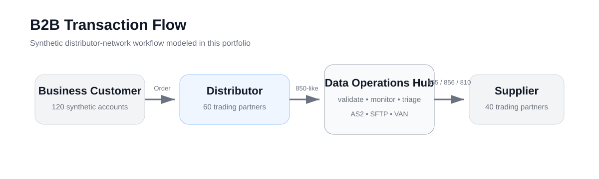
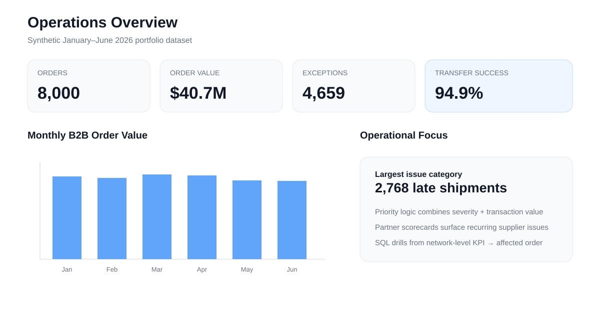
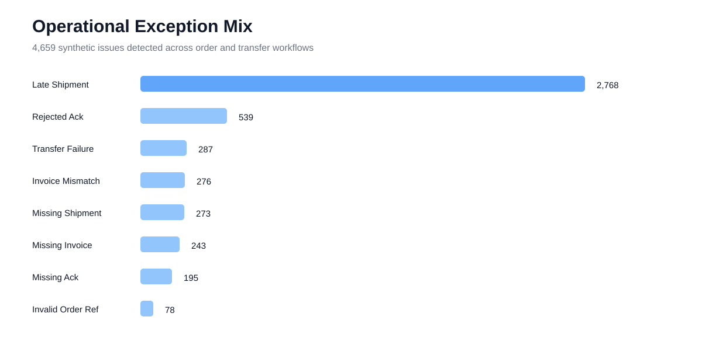
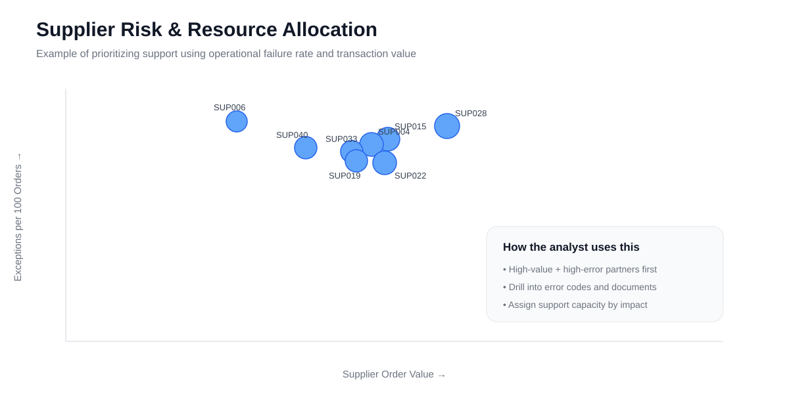
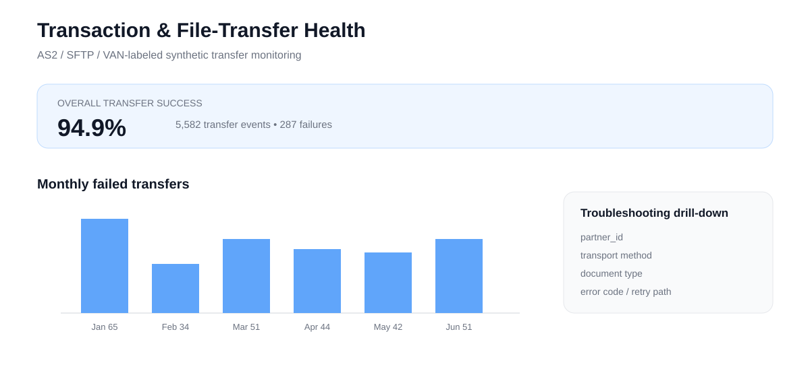

# B2B Supply Chain Data Operations

A synthetic portfolio project modeling the daily data-operations work behind a **B2B procurement and distributor network**.

The project follows transactions from **business customer → distributor → data operations hub → supplier** and monitors purchase orders, acknowledgments, shipment notices, invoices, and file-transfer events. It demonstrates SQL troubleshooting, data validation, operational monitoring, partner support, resource prioritization, and technical documentation.

> **Portfolio note:** All data is synthetic. This project is inspired by publicly described B2B distribution workflows and is not affiliated with AFFLINK, Performance Food Group, or any other company. The 850/855/856/810 files are simplified EDI-like training examples, not production ANSI X12 specifications.

## Business Process



## Portfolio Snapshot



The synthetic environment includes:

- **40 suppliers**
- **60 distributors**
- **120 B2B customers**
- **8,000 orders**
- **$40.7M synthetic order value**
- Purchase Order → Acknowledgment → Shipment Notice → Invoice lifecycle
- AS2 / SFTP / VAN-labeled transfer events
- Intentionally injected operational exceptions

## Operational Exception Monitoring

A transaction can fail even when an order itself is valid: a supplier can reject an order, an acknowledgment may never arrive, a ship notice can be late, an invoice can reference the wrong order, or an electronic transfer can fail.



The validation workflow detects:

- missing acknowledgments
- rejected acknowledgments
- missing or late shipment notices
- missing invoices
- invoice amount mismatches
- invalid order references
- transfer failures

## Partner Performance & Resource Allocation

The project goes beyond counting errors. It combines **partner business value, transaction volume, and operational exception burden** so an analyst can decide where support capacity should be focused.



Examples of business questions:

- Which suppliers have the highest operational failure rates?
- Are high-error suppliers also high-value partners?
- Which partner issues should be worked first?
- Where could mapping, integration, or process fixes have the largest impact?

## Transaction Health



The transfer-monitoring layer models AS2 / SFTP / VAN-labeled events and supports drill-down by:

- partner
- transport method
- document type
- error code
- date

## Interactive Dashboard

Run the Streamlit application for five operational views:

1. **Overview** — transaction volume, order value, exception mix, and product-category activity
2. **Transaction Flow** — lifecycle coverage and transfer failures by transport/document type
3. **Partner Performance** — supplier risk scatter and scorecard
4. **Exception Queue** — severity/value-based issue prioritization with recommended actions
5. **Resource Allocation** — ranking of partners requiring the most operational support

See [Dashboard Guide](docs/DASHBOARD_GUIDE.md) for the full walkthrough.

## Project Structure

- `src/generate_synthetic_data.py` — generates synthetic customers, suppliers, distributors, products, orders, documents, and transfer logs
- `src/validate_transactions.py` — loads data to SQLite and runs repeatable data-quality controls
- `src/build_issue_queue.py` — prioritizes exceptions by severity and transaction value
- `src/edi_like_parser.py` — validates simplified 850/855/856/810-like documents
- `sql/` — reusable SQL for exception monitoring, lifecycle analysis, partner performance, and resource allocation
- `app/dashboard.py` — multi-view Streamlit operations dashboard
- `assets/` — static portfolio visuals embedded in this README
- `docs/` — business-process documentation, data dictionary, troubleshooting runbook, dashboard guide, and interview talk track
- `tests/` — automated validation tests

## Example Analyst Workflow

1. Daily monitoring identifies a spike in failed invoice transfers.
2. SQL groups errors by supplier, transport method, and error code.
3. High-value affected orders move to the top of the issue queue.
4. The analyst validates order references and invoice amounts.
5. Recurring schema or connection issues are escalated.
6. Resolution steps are documented in the troubleshooting runbook.
7. Partner performance is monitored for recurring patterns.
8. Analyst capacity is redirected toward high-impact trading partners.

## Run Locally

```bash
python -m venv .venv
source .venv/bin/activate
pip install -r requirements.txt

python src/generate_synthetic_data.py
python src/validate_transactions.py
python src/build_issue_queue.py
pytest -q
streamlit run app/dashboard.py
```

Or:

```bash
make all
make app
```

## Skills Demonstrated

**SQL · Python · SQLite · Streamlit · Data Validation · Data Integration · B2B Operations · Supply Chain Analytics · Transaction Monitoring · Data Quality · Root-Cause Analysis · Resource Allocation · Partner Performance · Operational Reporting · Technical Documentation · EDI-adjacent Workflows · AS2/SFTP/VAN Concepts**
