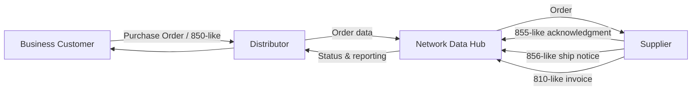

# Business Process

## Scenario

This project models a B2B procurement/distribution network in which independent distributors connect business customers with multiple suppliers. The operating challenge is not simply reporting revenue; it is keeping transaction data moving accurately across trading partners.

## Analyst responsibilities simulated

1. Monitor daily electronic transaction flows.
2. Detect missing, rejected, late, or inconsistent records.
3. Use SQL to isolate affected orders and trading partners.
4. Prioritize issues by operational impact and transaction value.
5. Track partner-level reliability and recurring error patterns.
6. Document troubleshooting steps and escalation rules.
7. Communicate findings in business language rather than only technical metrics.

## Transaction lifecycle

| Stage | Training document | Business meaning |
|---|---|---|
| Order | 850-like | Customer/distributor submits purchase order |
| Acknowledgment | 855-like | Supplier accepts or rejects order |
| Ship notice | 856-like | Supplier reports shipment and tracking |
| Invoice | 810-like | Supplier bills for the fulfilled order |

The sample messages are deliberately simplified and are **not ANSI X12 compliant**. They are included only to demonstrate document routing, required-field checks, and troubleshooting logic.
